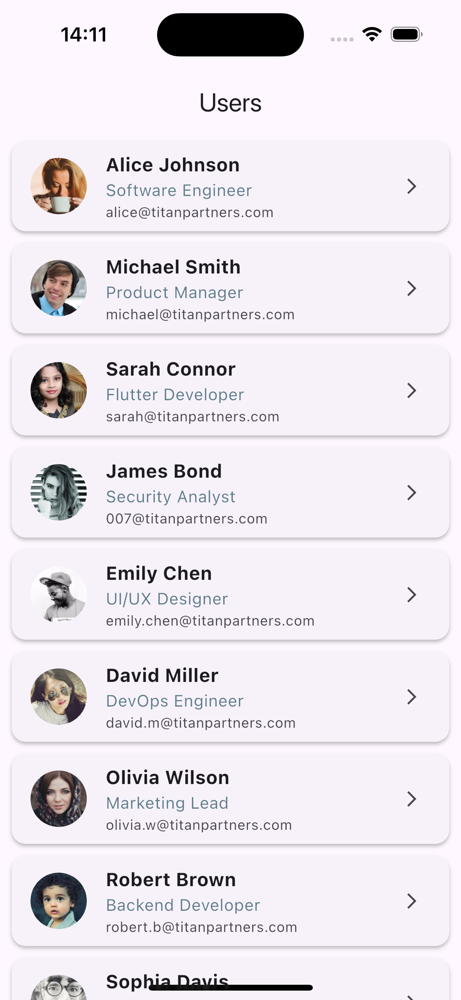
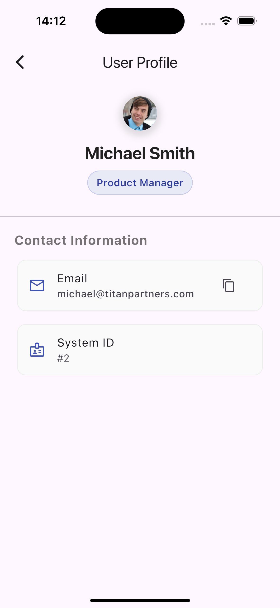

# nexteramediagroup_mobile

A new Flutter project.

## Getting Started

This project is a starting point for a Flutter application.

A few resources to get you started if this is your first Flutter project:

- [Lab: Write your first Flutter app](https://docs.flutter.dev/get-started/codelab)
- [Cookbook: Useful Flutter samples](https://docs.flutter.dev/cookbook)

For help getting started with Flutter development, view the
[online documentation](https://docs.flutter.dev/), which offers tutorials,
samples, guidance on mobile development, and a full API reference.

---
<p align="center">


</p>
## Development Setup

Follow these steps to set up and run the project locally. This project requires specific versions of Flutter and Dart to run correctly.

**Required Versions:**
* **Flutter:** 3.38.5
* **Dart:** 3.10.4

### 1. Prerequisites
Ensure you have the following installed:
* [Git](https://git-scm.com/)
* [VS Code](https://code.visualstudio.com/) or [Android Studio](https://developer.android.com/studio)
* **FVM (Flutter Version Management)** (Recommended)
    * *To install FVM:* `dart pub global activate fvm` or via Homebrew `brew tap leoafarias/fvm && brew install fvm`.

### 2. Project Setup (Clean Method)

We recommend using **FVM** to ensure you are using the exact required Flutter version without affecting your global setup.

1.  **Clone the repository:**
    ```bash
    git clone <YOUR_REPO_URL>
    cd nexteramediagroup_mobile
    ```

2.  **Install the required Flutter version:**
    ```bash
    fvm install 3.38.5
    fvm use 3.38.5
    ```

3.  **Install Dependencies:**
    ```bash
    fvm flutter pub get
    ```

4.  **iOS Setup (macOS only):**
    If you are running on an iOS simulator or device:
    ```bash
    cd ios
    pod install
    cd ..
    ```

### 3. Running the App

**Using FVM (Recommended):**
```bash
fvm flutter run